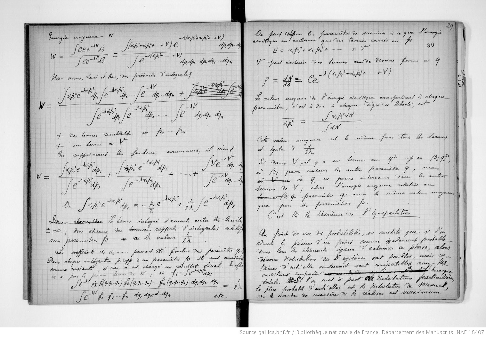
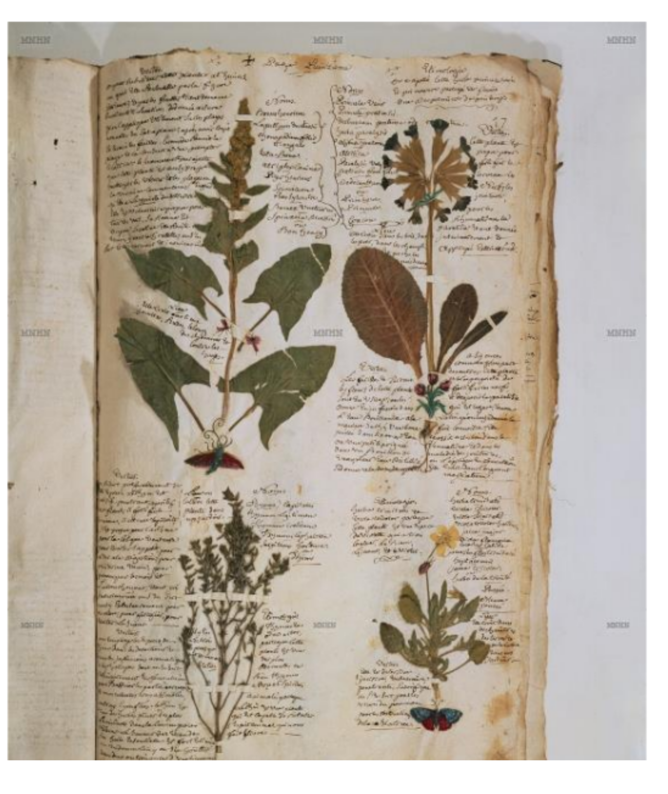

# Table of Contents

<!-- MarkdownTOC autolink="True" -->

- [1. What is the Research Data Life Cycle?](#1-what-is-the-research-data-life-cycle)
    - [1.1 Research data.](#11-research-data)
    - [2.2 The Research Data Life Cycle explained](#22-the-research-data-life-cycle-explained)
- [2. Research Data Management \(RDM\)](#2-research-data-management-rdm)
    - [2.1 Rationale](#21-rationale)
    - [2.2 Quick definition in a small movie \(5min\)](#22-quick-definition-in-a-small-movie-5min)
- [3. Getting help from you local institution](#3-getting-help-from-you-local-institution)
    - [3.1 At the University of Amsterdam](#31-at-the-university-of-amsterdam)
    - [3.2 In the Netherlands](#32-in-the-netherlands)
    - [3.3 In Europe](#33-in-europe)
    - [3.4 In the rest of the world](#34-in-the-rest-of-the-world)
- [4. Resources](#4-resources)
- [6. Wageningen RDM course](#6-wageningen-rdm-course)

<!-- /MarkdownTOC -->

# 1. What is the Research Data Life Cycle? 

## 1.1 Research data.

> ## Discussion
> Pair up with someone in the workshop and try to define potential research data that you know.  
{: .discussion}

> ## Exercise
> From this list of items, can you choose which one are research data and why?
> 1. An article from a newspaper. 
> 2. An image taken from Wikipedia. 
> 3. Humidity level collected automatically by a hygrometer. 
> 4. Microscopy pictures taken by a scientist. 
>
> > ## Solution
> > Answers 3 and 4 would qualify as a research data. 
> {: .solution}
{: .challenge}  

In short, everything you use during your research project could be qualified as "research data": this definition would encompass quite a variety of items:

|    
 Laboratory notebook 
                                    | 
 Field notes 
                         |
|------------------------------------------------------------------------------|--------------------------------------------------------|
|     |  |

__Laboratory notebooks__  

<figure class="figure">
  
  <figcaption>
Laboratory notebook of Pierre Curie (1918)
 </figcaption>
</figure>

__Field notes__
<figure class="figure">
  
  <figcaption>
Botanical herbarium from Philibert Commerson (1743)
 </figcaption>
</figure>

## 2.2 The Research Data Life Cycle explained

Every piece of research goes through a series of steps. 

__Scheme of the Research Life Cycle.__ 

__Definition in a small movie (5min).__
The University of Ghent has assembled a collection of knowledge clip. Here's the one on the Research Data Life Cycle:

<iframe width="560" height="315" src="https://www.youtube.com/embed/OL_Vd9dd-AQ" frameborder="0" allow="accelerometer; autoplay; clipboard-write; encrypted-media; gyroscope; picture-in-picture" allowfullscreen></iframe>

 

# 2. Research Data Management (RDM)

## 2.1 Rationale

The main rationales for engaging in better Research Data Management (RDM) are:

1. To protect data from being lost: physical damage to hard drives, a laptop being stolen,
2. To make it easier and quicker way to find data: imagine having to find a dataset from a year ago because a collaborator or a reviewer ask you to.
3. To enhance the security of your data: by relying on common well-established technical services (e.g. data repositories), the security of your data will be increased as you will be able to control who has access to it, specify the exact conditions to deliver access, etc.  
4. To improve your scientific reputation and career outcome: even unpublished, you can be cited for the data you've generated and be acknowledged. Also, embracing good practices in RDM 
5. To ease the sharing of data in both short- and long-term perspectives: you know where your data is located, what are the conditions to access it, how your data is formatted, etc. 

## 2.2 Quick definition in a small movie (5min)

<iframe width="560" height="315" src="https://www.youtube.com/embed/bbsLmy3Njv4" frameborder="0" allow="accelerometer; autoplay; clipboard-write; encrypted-media; gyroscope; picture-in-picture" allowfullscreen></iframe>

# 3. Getting help from you local institution

## 3.1 At the University of Amsterdam

The library hosts a Research Data Management helpdesk...

## 3.2 In the Netherlands

## 3.3 In Europe

## 3.4 In the rest of the world

# 4. Resources

- University of Amsterdam (NL) [Research Data Management resource](https://rdm.uva.nl/en/introduction/rdm-introduction.html).
- University of Ghent (BE) Data Stewards [Youtube channel](https://www.youtube.com/channel/UCYKOuXl0zNJ9QHt-HrlpZmg).
- University of Wageningen (NL) [Data Competence Center](https://www.wur.nl/en/Value-Creation-Cooperation/WDCC/Data-Management-WDCC.htm).
- The Open Science Training Handbook



<!-- 
# 6. Wageningen RDM course

Programme

Part 1: What is data management and how to set up your data collection system. At the end of part 1 you will:

    - be able to define research data and research data management;
    - understand how to systematically organise folders and (versions of) files;
    - know how to keep research notes to make a dataset understandable;
    - be aware of issues concerning privacy when working with people.

Part 2: Where to store your data and why share it? At the end of part 2 you will:

    - be familiar with the data storage solutions at WUR;
    - understand the (dis)advantages of different storage options;
    - understand the importance of making research data available to others;
    - be familiar with different open data licenses and their implications.

Part 3: How to make your data future-proof. At the end of part 3 you will:

    - know where and how to look for suitable repositories for your data;
    - know how to prepare a dataset for submission to a repository;
    - be familiar with the data management requirements, support and services at WUR;
    - have completed a draft data management plan for your project.
 -->
