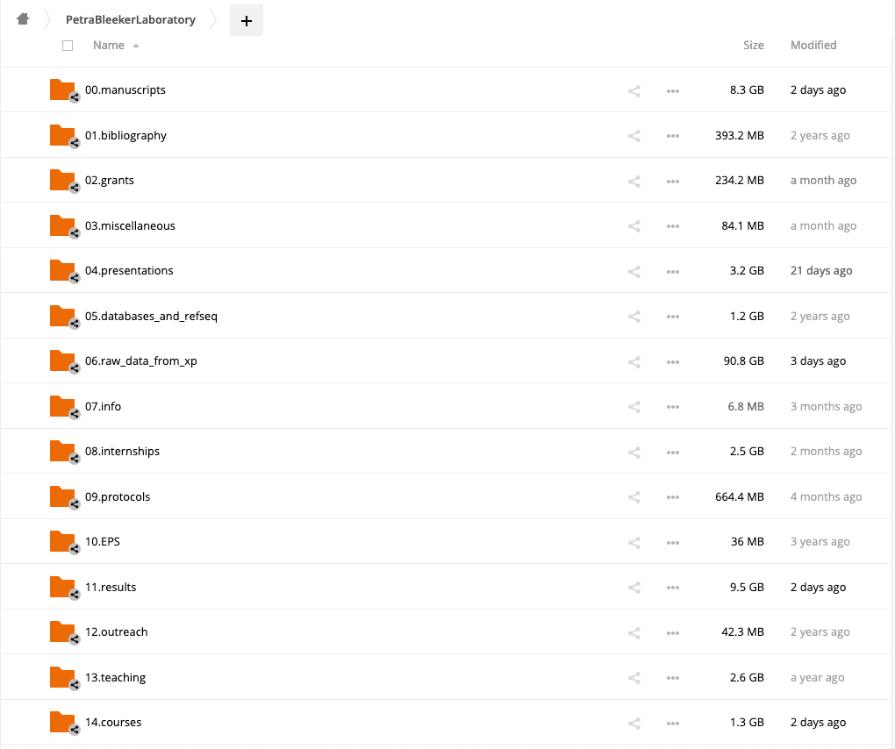
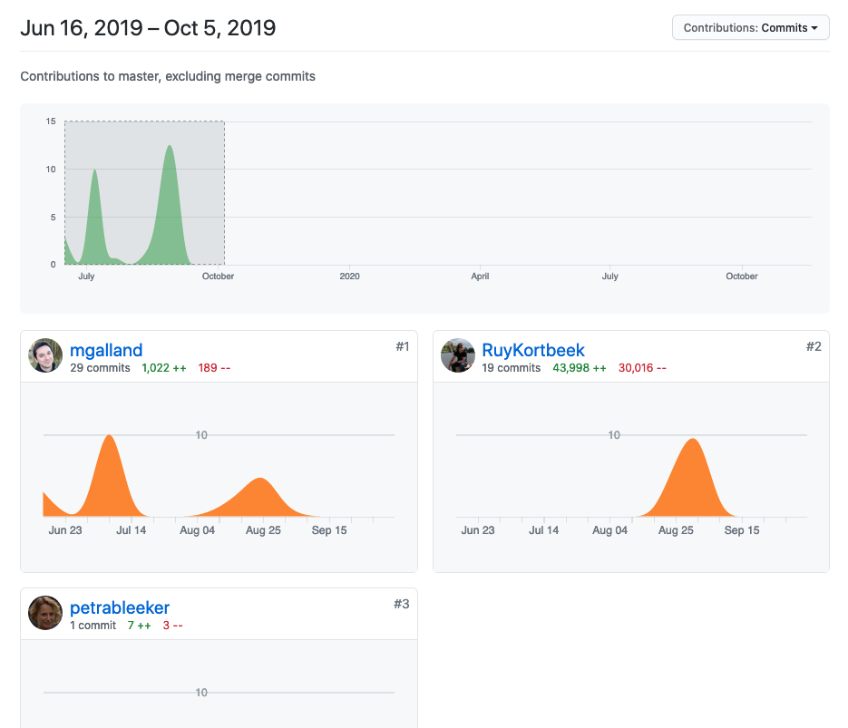

## Table of Contents

<!-- MarkdownTOC autolink="True" -->

- [1. Folder structure](#1-folder-structure)
    - [1.1. Good practices for folder organisation](#11-good-practices-for-folder-organisation)
    - [1.2 The README user guide file](#12-the-readme-user-guide-file)
    - [1.2 A real-life example](#12-a-real-life-example)
- [2. File naming](#2-file-naming)
    - [2.1 Consistency and convention](#21-consistency-and-convention)
    - [2.2 Good practices](#22-good-practices)
- [3. Hosting publication and scripts on a git hosting service \(e.g. GitHub\)](#3-hosting-publication-and-scripts-on-a-git-hosting-service-eg-github)
    - [3.1 Host your publication on a social network of code \(e.g. GitHub\)](#31-host-your-publication-on-a-social-network-of-code-eg-github)
    - [3.2 Set up a paper repository](#32-set-up-a-paper-repository)
    - [3.3 Display contributions and paper history](#33-display-contributions-and-paper-history)
- [4. Software Carpentry episode on data management](#4-software-carpentry-episode-on-data-management)
- [5. Resources](#5-resources)
    - [5.1 Blog post](#51-blog-post)
    - [5.2 Tutorials](#52-tutorials)

<!-- /MarkdownTOC -->

# 1. Folder structure

To avoid chaotic Desktop filled with hundreds of files in different formats and with different creation dates, you must set up a consistent and meaningful folder hierarchy. This is a worthy investment at the beginning that will save you time and brain power later on. It has also the potential to save your research project as a whole by helping backups and external reliable storage. 

> ## Discussion
> Pair up with your neighbour. Compare the folder and file structure from a research project from each other. List what is clear and what's not!
{: .discussion}

When you start a research project, it is often a good idea to think about a way to structure the information you will collect. Think about a way to organise the datasets, additional information, etc. that are related to your project.

How many did you come up with? The list of research data types is actually quite long and differ depending on your research domain. 

> ## Question
> How many different types of reaearch data can you list from the back of your head? 
> > ## Solution
> > This is rather a proposition than the solution, nevertheless, here a few suggestions:
> > 1. Image files. 
> > 2. Spreadsheet documents: comma-separated `.csv` files from measurements. 
> > 3. Presentations in open (PDF format, `.pdf`) or proprietary formats (e.g. Microsoft `.pptx`).
> > 4. Document files: open (ASCII UTF, plain text format) or proprietary file formats (`.doc`). This is a data type that comes in [many different flavors](https://en.wikipedia.org/wiki/Document_file_format).  
> > 5. Domain-specific files: mass spectrometry gas chromatography (.mzxml)
> {: .solution}
{: .challenge}

Yet, we've probably forgotten a few of these. Here is a more complete list taken from the [RDM section of the University of Leeds (UK)](https://library.leeds.ac.uk/info/14062/research_data_management/61/research_data_management_explained).

> ## A more complete list
> 
> > ## Complete list
> > Types of research data
>  > - documents,
> > - spreadsheets,
> > - laboratory and field notebooks, 
> > - questionnaires, 
> > - transcripts from conversations, 
> > - audiotapes, 
> > - videotapes,
> > - photographs, 
> > - database contents (video, audio, text, images)
> > - models, algorithms, scripts
> > - methodologies and workflows
> > - standard operating procedures and protocols
> {: .solution}
{: .challenge}

## 1.1. Good practices for folder organisation

Use a number in front of your folder (`01.admin/`) so that, even if the name of the folder is changed, the folder stays at the same location. 

## 1.2 The README user guide file 

Adding a small text file in some folders can help to disambiguify file naming conventions, provide guidance for future users, etc. 

For example, you could have an "01.Experiments/Molecular_Biology/" folder with a `README.txt` file at the top of this folder.  
Raw data need a README.txt file in the same folder with some human-readable explanation. This `README.txt` file should for instance contain:
1. __Lab notebook comments__ such as "This experiment will determine whether a loss-of-function of the gene _EATME_ of lettuce (_Lactuca sativa_) has an effect on the fresh weight of first stage caterpillar larvae from the _Manduca sexta_ (tobacco moth) species after 14 days. etc.".
2. __A data dictionnary__ for the column names in your spreadsheets (e.g. "weight: weight of the larvae in mg") to explain the meaning of columns and explicit measurement units or other ambiguous things.  

## 1.2 A real-life example

This is an example taken from a research group. 

> # Discussion
> Do you see mssing information that could go into its own folder?  
> Do you find it easy to understand what is inside each folder at a glance?
> {: .discussion}

# 2. File naming 

## 2.1 Consistency and convention

When starting a new research project (e.g. your PhD), one of the most profitable RDM practice is to implement a consistent and understandable folder and file anming structure. 

This consistent scheme will be applied to the same type of data for example. Think about one experiment where you collect samples from a field site and you will want to collect information on:
- The date of the result collection. 
- The person that collected the sample. 

## 2.2 Good practices

1. __Date formatting__ is perhaps both the most important and easiest to set. If you use the __YYYYMMDD__ format then your files will be easily sorted by date.
2. __Avoid special characters in file names__: avoid special characters and spaces when separating the different elements of your file name, do not use spaces or characters like "?@{[<>"" etc. Some software programs (e.g. R) do not work well with file names with these characters. You can use dashes and underscores instead.
__Find a consistent naming scheme and stick to it__: for instance, for images recorded from a stereomicroscope, a naming scheme could be:
  - `YYYYMMDD_genotype1_treated_rep1_original.tiff` for original images.
  - `YYYYMMDD_genotype1_treated_rep1_modified.tiff` for modified/cropped images.

   

# 3. Hosting publication and scripts on a git hosting service (e.g. GitHub)

We often think of a scientific publication as the holy grail of one scientist's work. While this is particularly true in a given academic environment where scientific prestige and reputation are directly related to the journal and citations you have, the _pièce de résistance_ (main content) lies in the collection of files underlying your research publication:  
- Manuscript: a piece of formatted text.
- Figures: image files (e.g. `.png` or `.jpeg`), vector graphic files (`.svg`, `.pdf`, `.eps`) formats, etc. 
- Supplementary information files
- Raw and/or processed data underlying the figures and scientific conclusions. 
- Data-processing code files (e.g. R script for a particular figure).  

## 3.1 Host your publication on a social network of code (e.g. GitHub)
- Data underlying figures and conclusions all hosted online openly.
- Add scripts underlying each figures in the same online repository.  
- Make it public at the end of the publication process. 
- The data to figure process is made more open and can be added to the publication itself.

- If data are too big to be hosted on GitHub (> 100Mb), provide a persistent identifier (doi, link) to the datasets. 
on GitHub

## 3.2 Set up a paper repository

In version control hosting service jargon, a "repository" is a place to put your precious publication-related data. This is obviously the first step. This is what it could look like in the end:

You can add a [tag](https://www.atlassian.com/git/tutorials/inspecting-a-repository/git-tag) to a certain version of the paper such as "version submitted to Nature journal on December 4, 2020". This would point to a specific commit number making it easy to trace back what has been submitted, when and who contributed at the time to the paper.  

## 3.3 Display contributions and paper history

In combination with `git`, GitHub will act as a "time machine" where all changes to files and figures are recorded. This makes it easy to undo things if necessary or to point to a specific change in history.

GitHub helps to list the number of contributions of each author. It can also be a way to see who contributed the most to a publication for instance in a rationale way.

> ## Discussion
> How does this version 

As you can see, two authors have contributed relatively equally to this publication as can be seen from the number of commits. Yet, one commit can be rather small (changing one file and committing) or be the result from a more extensive work (creating a figure, adding the related script, etc.). This depends on the "commit behaviour" of the person in this case. 

> ## Discussion
> What do you think are some pros and cons for hosting your publication on a git hosting service? Can you think of short-term and long-term benefits for your research?
{: .discussion} 

One drawback of using a version control system in parallel with a hosting service is that it is not meant to store _BIG_ data file. Ignore these _BIG_ data files by listing directories that should be ignored in a `.gitignore` file.  
Assuming your big raw data files are in a directory called `raw_data/`, you could type the following command in your favorite Shell terminal to ignore them:

~~~
echo "raw_data/" >> .gitignore
~~~
{: .language-bash}  

# 4. Software Carpentry episode on data management

Some simple tips from the Software Carpentry Data Management lesson:

<iframe width="560" height="315" src="https://www.youtube.com/embed/3MEJ38BO6Mo" frameborder="0" allow="accelerometer; autoplay; clipboard-write; encrypted-media; gyroscope; picture-in-picture" allowfullscreen></iframe>

# 5. Resources

## 5.1 Blog post
- A nice blog post on how git and GitHub are particularly well suited for scientific project and file management: [link](https://grasshoppermouse.github.io/2019/07/12/should-scientific-publishing-move-to-github-and-friends/).
- List of academic publications hosted on GitHub: [https://github.com/topics/academic-publication](https://github.com/topics/academic-publication)

## 5.2 Tutorials
- [The Software Carpentry Lesson on version control with git and GitHub](https://swcarpentry.github.io/git-novice/). 
- [A Life Science workshop on the Carpentries Incubator](https://carpentries-incubator.github.io/life-sciences-workshop/01-project-organisation-introduction/index.html). The Carpentries Incubator is a place to host lessons in development not officially endorsed by the Carpentries Foundation. 


