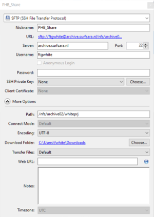

# Table of contents

<!-- MarkdownTOC autolink="True" -->

- [1. Introduction](#1-introduction)
	- [1.1 Backup and archiving](#11-backup-and-archiving)
	- [1.2 Long-term data preservation becomes more crucial](#12-long-term-data-preservation-becomes-more-crucial)
- [2. Tape Archive](#2-tape-archive)
- [2. The SURFsara Data Archive](#2-the-surfsara-data-archive)
- [3. How to archive data with SURF data archive](#3-how-to-archive-data-with-surf-data-archive)
	- [3.1 Tools To Connect](#31-tools-to-connect)
	- [3.2 Connecting to SURF data archive](#32-connecting-to-surf-data-archive)
	- [Transferring data](#transferring-data)
		- [Using a GUI](#using-a-gui)
		- [Using command line](#using-command-line)
	- [3.3 Archive Internal Data Transfer](#33-archive-internal-data-transfer)
- [References](#references)

<!-- /MarkdownTOC -->

    

# 1. Introduction

## 1.1 Backup and archiving

This alone means that storing data on various hard drives scattered around the university or at home is not great practice. Hard drives are prone to physical destruction if they fall or being lost or stolen for instance.    

__Data archiving__ should indeed not be be confused with __data backup__:
- __Data backup:__ a data backup makes sure that research data which are regularly accessed can be quickly recovered if something happens (fire, theft). Moreover, a data backup can be _instantaneously_ accessed because the data is on a electrically powered drive and because a disk drive moves rapidly to read the data stored on the hard disk.  
- __Data archiving:__: Data archiving on the other hand serves to preserve data you do not access regularly and ensures long-term preservation. 

## 1.2 Long-term data preservation becomes more crucial

Due to the increasing volume of data being generated in research (e.g. DNA sequencing or imaging), it has become more complex to store large and heterogeneous volumes of data easily. 
Yet, the possibility to re-use research data rather than automatically regenerate new data also becomes important as techniques to aggregate numerous datasets become more commonplace. One such example is Machine Learning that requires large amount of well-curated and labeled data in order to generate meaningful results. 

In addition, research funding agencies or Universities increasingly require that research data are stored for 3 to 10+ years as can be seen from several national research agencies: 
- [Dutch Research Council (NWO)](https://www.nwo.nl/en/research-data-management) (Dutch Research Council).
- [British Biotechnology and Biological Sciences Research Council (BBRSC)](https://researchdata.ox.ac.uk/funder-requirements/bbsrc/)
- [US National Institute of Health](https://grants.nih.gov/grants/policy/data_sharing/data_sharing_guidance.html)
- etc.

# 2. Tape Archive

When it comes to data archiving, storing on hard drives can become quite expensive rapidly. One of the reasons is that hard drives need to be electrically powered in order to be readable by the disk driver. Current estimate are 120€ per terabyte per year (source: SURFsara, 2019).

Data volumes have significanly 
Short-term versus long-term storage

Need staging  slower access to data

hard disk drive versus tape drive

|    
 Hard disk drive 
                  | 
 Magnetic tape drive 
                 |
|-----------------------------------------------------   |--------------------------------------------------------|
|     |  |
| Short-term storage                                     | Long-term storage (no electricity required)            | 
| Maximum storage capacity per unit = 100TB (SSD, 2018)  | Maximum storage capacity of 45TB (2018,LTO9)           | 
| Instantaneous data access                              | Sequential access: data needs to be staged on disk first| 

# 2. The SURFsara Data Archive

[SURF](https://www.surf.nl/en) is defined as:
> "a cooperative association of Dutch educational and research institutions in which its members join forces. The members are the owners of SURF."
Source: [SURF website](https://www.surf.nl/en/about-surf/the-surf-cooperative)
The SURF organisation runs a [data archive service](https://www.surf.nl/en/secure-long-term-storage-with-data-archive)

Data stored on the archive is stored in two physical locations. This is much more secure, and can be accessed from any machine with an internet connection plus login credentials.  

For example, the SURFsara data archive is located at two locations: one in Almere and one in Amsterdam within the Amsterdam Data Center which is a 72m-tall building with 13 floors (see below). 

<figure class="figure">
  
  <figcaption>
The Amsterdam Data Tower
 </figcaption>
</figure>
 

Access to the data center is being checked through ID and fingerprints at the entrance. 

<figure class="figure">
  
  <figcaption>
Identity check to enter the servers within the Amsterdam Data Tower
 </figcaption>
</figure>
 

SURFsara rents some space inside the tower to host its Tape Archive service. On the picture, you can see the magnetic tapes on the different rows. When requested, the tapes are read by a robot which stages them on a hard disk thereby allowing data to be read.  
    
<figure class="figure">
  
  <figcaption>
The SURF tape archiver
 </figcaption>
</figure>

# 3. How to archive data with SURF data archive 

## 3.1 Tools To Connect

The tools used for uploading/accessing/transferring are common for both data processing and managing archive data. 

Some differ depending on operating systems.

__Cross-platform tools with a GUI: Cyberduck and FileZilla__

Some filemanagers have a Graphical User Interface (_GUI_) that can be installed on both Windows or Mac OS X operating systems. 
Files can be transferred across the data processing/archiving systems using a GUI filemanager like [Cyberduck](https://cyberduck.io/) or [filezilla](https://filezilla-project.org/) _Warning_ Filezilla not yet suitable for cross server transfer.

__Windows specific (choose one option):__
  - _SSH client_ [Mobaxterm](https://mobaxterm.mobatek.net/download.html) is recommended if you don't already have a preferred method.
  - To use a Windows 10 machine as if it were linux: _Windows subsystem for linux (WSL)_ - details on setting this up can be found [here](https://www.windowscentral.com/install-windows-subsystem-linux-windows-10). _THIS IS NOT A NECESSARY STEP_. The above can be used instead.

__MacOS/Linux__
  - _Terminal_ is built in for both Mac and Linux machines. It can be used as an ssh client.

## 3.2 Connecting to SURF data archive 

__Using a GUI:__
Cyberduck is the recommended GUI for file transfer with the SURF Data Archive. See the [Cyberduck website](https://cyberduck.io/) for more information. Or for some [tips from SURF](https://userinfo.surfsara.nl/systems/shared/archiving-high-performance).

__Using command line/ssh client:__ If using an ssh client on windows then you can input the required details to connect similarly to the GUI option.

Otherwise open up preferred method for ssh connection and type the following:

~~~
ssh USER@archive.surfsara.nl
~~~
{: .language-shell}

Then input your password when prompted.

## Transferring data

When transferring data; remember that the tape system is not instant and your files will get stored distributed across their system. For this reason if you want to store lots of small files then these need to be collected together into a tar archive beforehand.

#### How to create a tar archive

_Non-Command Line Interface_

No built in tarballing in windows. [7-zip](https://www.7-zip.org/) is currently recommended to add this functionality. A tutorial on how to use it can be found [here](https://dailydoseoftech.com/how-to-open-and-create-tar-files-on-windows/). A 7-ZIp equivalent is also available for MAC, see the 7-zip link.

_Mac/Linux/WSL_
Using terminal: 

~~~
tar -cvf NEWFILENAME.tar path/to/originalfile
~~~
More details on tar can be found [here](https://www.tecmint.com/18-tar-command-examples-in-linux/)

### Using a GUI

When using cyberduck for file transfer between servers be sure to open two separate windows with separate connections. This is the easiest method of data transfer, but also the slowest as there is no way to stage your data before making the transfer.

### Using command line

At the command line there are a number of different ways to transfer data. Currently recommended by SURF is [rclone](https://rclone.org/commands/rclone_sync/). High performance transfer is available but needs to be setup on your local machine/server, info [here](https://userinfo.surfsara.nl/systems/shared/archiving-high-performance).

Easy method: [rsync](https://www.digitalocean.com/community/tutorials/how-to-use-rsync-to-sync-local-and-remote-directories).
Rsync is installed already. Currently you must log into crunchomics and "push" to the archive using the following command:

~~~
screen
rsync -ravz FILES USERNAME@archive.surfsara.nl:/nfs/archive02/whiteprj
~~~
Ensuring to replace the FILES and USERNAME with your own details (and that the file is already a tar archive). 
Screen command is needed for larger files unless you want to keep the terminal open the whole time. It will ask for your archive password, this will then sync it to the shared folder (called whiteprj).

Please ensure adequate metadata is provided in your tar archive.

## Archive Internal Data Transfer

Transferring data between members of the group can be done using cyberduck. There is a shared folder for the group this can be accessed through cyberduck, all group members have access to this folder. In order to allow permissions to someone else copy or deposit your data here. The data manager can then ensure it is transferred to the correct account and delete it from shared folder. It is recommended to bookmark this folder within cyberduck, otherwise finding it is a bit tedious. In this example the shared folder is called whiteprj.

# References

- [Tape Drive](https://en.wikipedia.org/wiki/Tape_drive)
- [Utrecht University guide to data preservation](https://www.uu.nl/en/research/research-data-management/guides/storing-and-preserving-data)


