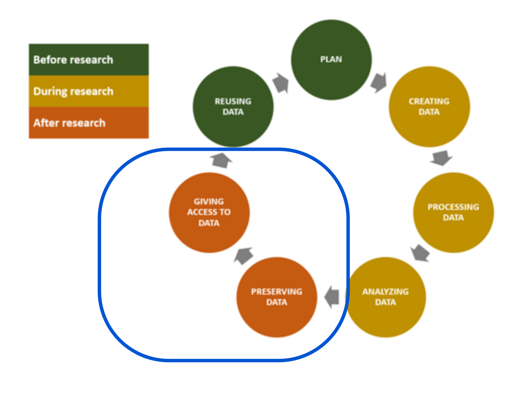

# 1. Table of contents

<!-- MarkdownTOC autolink="True" -->

- [1. Introduction](#1-introduction)
    - [1.1 Definition of an open-access repository](#11-definition-of-an-open-access-repository)
    - [1.2 Open and public data](#12-open-and-public-data)
- [2. Choosing a license](#2-choosing-a-license)
    - [2.1 Why licensing your dataset?](#21-why-licensing-your-dataset)
    - [2.2 Available licenses and their differences](#22-available-licenses-and-their-differences)
- [3. Real-life example with Zenodo](#3-real-life-example-with-zenodo)
    - [3.1](#31)
    - [3.1 Zenodo](#31-zenodo)
- [4. FigShare](#4-figshare)
- [5. Dryad](#5-dryad)
- [4. Real-life exercise](#4-real-life-exercise)
- [5. Resources](#5-resources)
    - [5.1 Open-access repositories](#51-open-access-repositories)
    - [5.2 Open data](#52-open-data)

<!-- /MarkdownTOC -->

# 1. Introduction

In this section, we will see how to preserve and support access to your research data generated during the course of your work. 
This episode on steps 5 and 6 of the Research Data Life Cycle. 

Open Access often refers to free access to research publications. In this episode, Open Access will strictly refer to research outputs that are not publications themselves but rather additional resources collected that support the research conclusions and related publications. 

## 1.1 Definition of an open-access repository

An open-access repository is a digital hosting service for the safe storage, data annotation and retrieval of research outputs. 
Open Access here means that datasets are made freely accessible either instantly or after an embargo period (becomes free after a certain time). 

> ## Question
> Do you already know examples of open-access repositories? 
> > ## Answer
> > If you continue the lesson, you will discover that Zenodo, FigShare or Dryad are examples of open-access repositories. 
> {: .solution}
{: .challenge}

## 1.2 Open and public data
Open access does not necessary imply that all datasets are made public directly after upload to the data repository. Rather, these datasets should be made accessible and indicate on which conditions these can be used by others (i.e. license).    

Taken from the EU FOSTER portal

> ## Question
> What would be a real-life example of a dataset that should be made accessible (open) but not public (keep private)?   
> Can you name a few examples?
> > ## Answer
> > Clinical studies in which human patient data are collected is such an example of research data that should be accessible (by other clinical researchers for instance) but should not be made public.
> > DNA sequencing is also treated  
> {: .solution}
{: .challenge}

# 2. Choosing a license

## 2.1 Why licensing your dataset? 

## 2.2 Available licenses and their differences

# 3. Real-life example with Zenodo

In this section, you will mimick a real-life example. You have just obtained statistics on 

1. Download a test dataset. Description of the dataset
2. If not already done, create an account on Zenodo. 

Sandbox: Zenodo has a "sandbox" website that is made to test data upload 
https://zenodo.org/communities/

## 3.1 

## 3.1 Zenodo

# 4. FigShare

# 5. Dryad

# 4. Real-life exercise

# 5. Resources

## 5.1 Open-access repositories
- [Zenodo Frequently Asked Questions](https://help.zenodo.org/)

## 5.2 Open data
- [Open Data and Open Access](https://training.parthenos-project.eu/sample-page/manage-improve-and-open-up-your-research-and-data/open-data-open-access-and-open-science/)