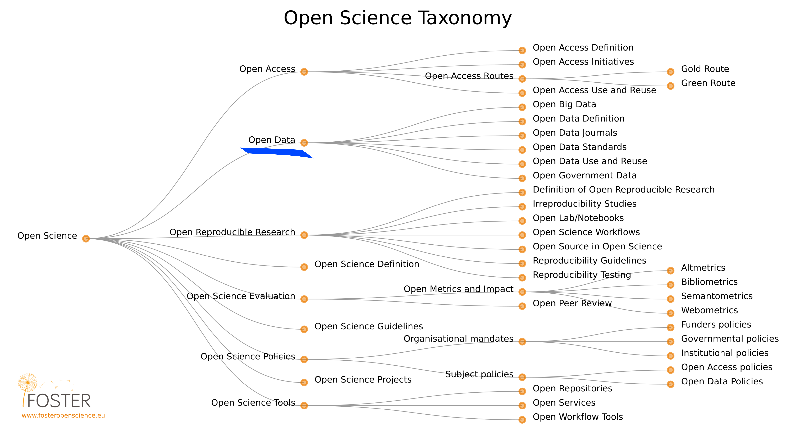

# Table of Contents

# 1. Open Science

# 2. Open Data
Open Data are online, free of cost, accessible data that can be used, reused and distributed provided that the data source is attributed and shared alike.

